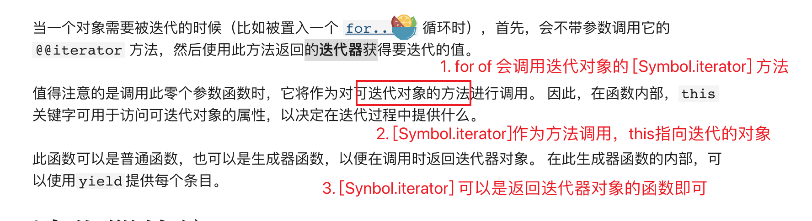

# iterator

迭代协议: 迭代协议分为**可迭代协议**和**迭代器协议**

**可迭代协议**允许 JavaScript 对象定义或定制它们的迭代行为（**可迭代对象**必须要有 [Symbol.iterator] 属性，该属性是一个方法）



**迭代器协议**定义了产生一系列值（无论是有限个还是无限个）的标准方式（也就是说规定了一个**迭代器(对象)**要有 next 方法且执行该方法要返回{ value: xx, done: boolean }的形式）

```js
// obj 是可迭代对象，（这个对象有 [Symbol.iterator] 方法，且返回迭代器对象）
const obj = {
  a: 1,
  b: 2,
  [Symbol.iterator]() {
    const result = {
      // result 是迭代器对象(又称迭代器)
      next() {
        return { value, done: true };
      },
    };
    return result;
  },
};
```

# generator

1. yield

2. 方法 next return throw

3. next 参数

**generator执行产生的对象既是迭代器也是可迭代对象**


# other

1. 将对象变为可迭代对象

```js
const obj = {
  a: 1,
  b: 2,
};
function toIteratorObject(obj) {
  obj[Symbol.iterator] = function () {
    const keys = Object.keys(obj),
      len = keys.length;
    let index = 0;
    return {
      next() {
        const key = keys[index],
          value = obj[key],
          result =
            index >= len
              ? { value: undefined, done: true }
              : {
                  value: { key, value, self: obj },
                  done: false,
                };
        index++;
        return result;
      },
    };
  };
  return obj;
}

for (let { key, value, self } of toIteratorObject(obj)) {
  console.log(key, value, self);
}

console.log([...toIteratorObject(obj)]);
```

2. 使用 generator 简化操作

```js
const obj = {
  a: 1,
  b: 2,
};
function* toIteratorObject(obj) {
  const keys = Object.keys(obj);
  let index = 0;
  while (index < keys.length) {
    const key = keys[index],
      value = obj[key];
    yield { key, value };
    index++;
  }
}

for (const iterator of toIteratorObject(obj)) {
  console.log(iterator);
}

console.log([...toIteratorObject(obj)]);
```

3. 使用 generator 模拟 await

```js
function* test() {
  let res = yield 1111;
  console.log(res);
  res = yield fetch('http://127.0.0.1:1234')
    .then((res) => res.json())
    .then((res) => res.data);
  console.log(res);
  res = yield 2222;
  console.log(res);
  res = yield fetch('http://127.0.0.1:1234/user')
    .then((res) => res.json())
    .then((res) => res.data);
  console.log(res);
  res = yield 3333;
  console.log(res);
}

// 通用函数
function run(callback) {
  const generator = callback();
  let result = generator.next();
  (function inner() {
    if (result.done) return;
    else {
      // is promise
      if (result && typeof result.value.then === 'function') {
        result.value.then((res) => {
          result = generator.next(res);
          inner();
        });
      } else {
        // no promise
        result = generator.next(result.value);
        inner();
      }
    }
  })();
}
run(test);
```
